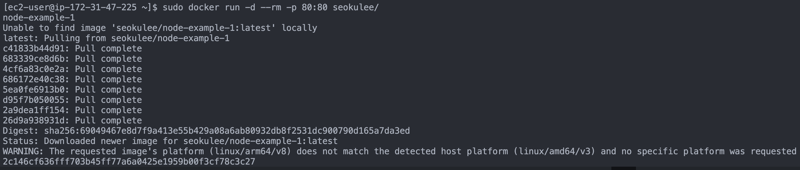
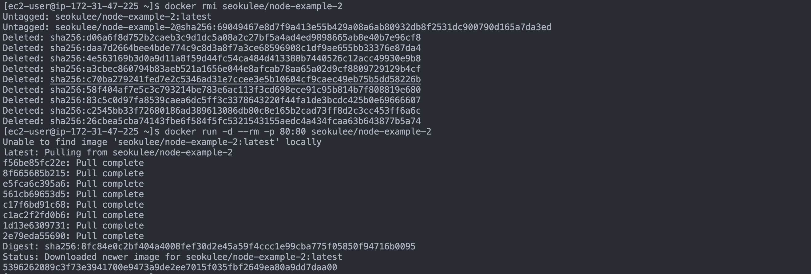

## 환경

로컬환경
- M1 MacBook Pro
- Docker version 27.2.0
- Dockerfile Image: node:14-alpine

EC2환경
- Amazon Linux
- Docker version  25.0.5
- 64bit x86 / arm Option
- t2.micro

## 발생한 에러

로컬환경에서 빌드한 이미지를 Docker Hub에 push 한 뒤 EC2에 컨테이너를 수동으로 배포하는데 다음과 같은 error가 발생했습니다.



**WARNING: The requested image's platform (linux/arm64/v8) does not match the detected host platform (linux/amd64/v3) and no specific platform was requested**

WARNING: The requested image's platform does not match the detected host platform and no specific platform was requested

## 해결 방법

해당 오류는 M1 맥북으로 빌드한 이미지 플랫폼(linux/arm64/v8)과 제가 선택한 EC2의 플랫폼(linux/amd64)이 맞지 않아 발생했습니다.

이를 해결하기 위해 이미지 빌드 시 `--platform` 옵션을 사용하여 빌드했습니다.

```bash
$ docker build --platform linux/amd64 -t [ImageName] .
```

## 추가로 생각해본 것

지금은 EC2의 Error Log에 맞게 플랫폼 옵션을 사용했지만 Multi-Platform을 지원하기 위해 다음과 같이 빌드하기도 합니다.

```bash
$ docker build --platform linux/amd64, linux/arm64 .
```

로컬환경에서 빌드 -> Docker Hub에 push -> EC2에서 pull 받아 다시 배포했습니다.

## 주의할 점

도커는 컨테이너 실행 시 도커 명령어를 실행한 로컬에서 먼저 이미지를 찾고, 없으면 Docker Hub에서 찾습니다. 이 말인즉슨 이미 로컬에 이미지가 존재한다면 기존 이미지를 사용할 것입니다.
그래서 기존 이미지를 지운 다음 다시 실행했습니다.



[REF]

[docker docs](https://docs.docker.com/build/building/multi-platform/)
